# Quantifying the Commons 2026Q2

<!-- SECTION start gcs_report.py -->

## Google Custom Search (GCS)

<!-- gcs_report.py entry start Overview -->

### Overview

Google Custom Search (GCS) data uses the `totalResults` returned by API for search queries of the legal tool URLs (quoted and using `linkSite` for accuracy), countries codes, and language codes.

**The results indicate there are approximately 36,553,349,498 online works in the commons--documents that are licensed or put in the public domain using a Creative Commons (CC) legal tool.**

Thank you Google for providing the Programable Search Engine: Custom Search JSON API!

<!-- gcs_report.py entry end Overview -->

<!-- gcs_report.py entry start Products totals and percentages -->

### Products totals and percentages

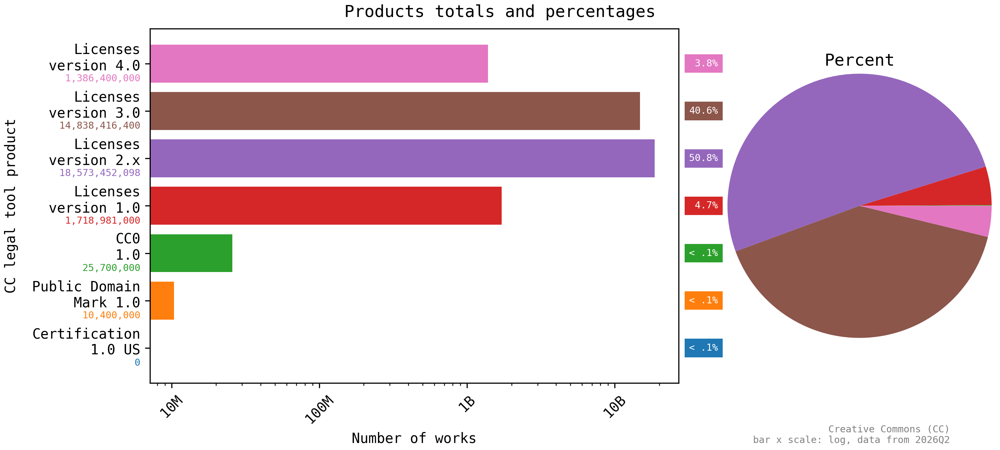

The plot shows Creative Commons (CC) legal tool product totals and percentages.

<!-- gcs_report.py entry end Products totals and percentages -->

<!-- gcs_report.py entry start CC legal tools status -->

### CC legal tools status

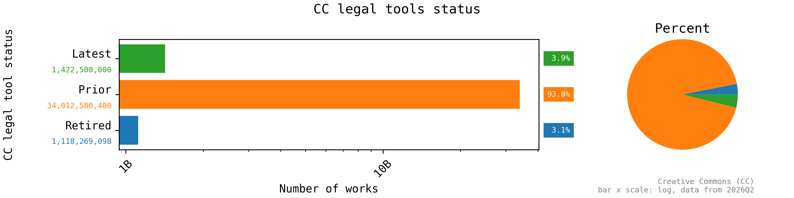

The plot shows Creative Commons (CC) legal tool status totals and percentages.

<!-- gcs_report.py entry end CC legal tools status -->

<!-- gcs_report.py entry start Latest CC legal tools -->

### Latest CC legal tools

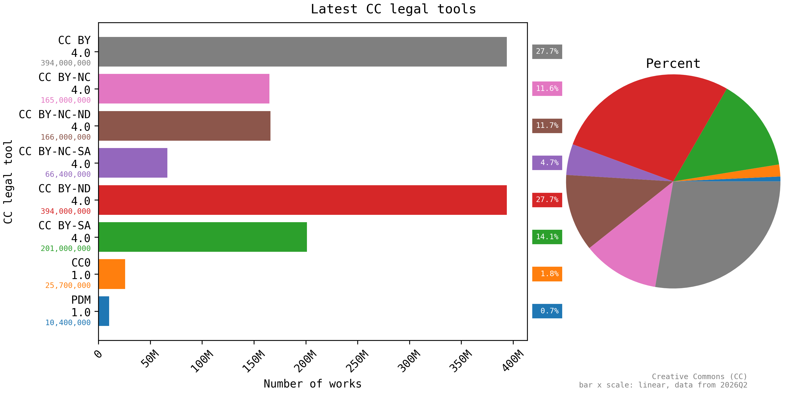

The plot shows the latest Creative Commons (CC) legal tool totals and percentages.

<!-- gcs_report.py entry end Latest CC legal tools -->

<!-- gcs_report.py entry start Prior CC legal tools -->

### Prior CC legal tools

The plot shows prior Creative Commons (CC) legal tool totals and percentages. The unit names have been normalized (~~`CC BY-ND-NC`~~ => `CC BY-NC-ND`).

<!-- gcs_report.py entry end Prior CC legal tools -->

<!-- gcs_report.py entry start Retired CC legal tools -->

### Retired CC legal tools

.](3-report/gcs_status_retired_tools.png)

The plot shows retired Creative Commons (CC) legal tools total and percentages. For more information on retired legal tools, see [Retired Legal Tools - Creative Commons](https://creativecommons.org/retiredlicenses/).

<!-- gcs_report.py entry end Retired CC legal tools -->

<!-- gcs_report.py entry start Countries with highest usage of latest tools -->

### Countries with highest usage of latest tools

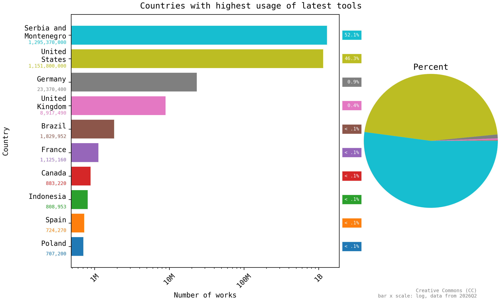

The plot shows countries with the highest useage of the latest Creative Commons (CC) legal tools.

The latest tools include Licenses version 4.0 (CC BY 4.0, CC BY-NC 4.0, CC BY-NC-ND 4.0, CC BY-NC-SA 4.0, CC-BY-ND 4.0, CC BY-SA 4.0), CC0 1.0, and the Public Domain Mark (PDM 1.0).

The complete data set indicates there are a total of 2,495,972,054 online works using one of the latest CC legal tools.

<!-- gcs_report.py entry end Countries with highest usage of latest tools -->

<!-- gcs_report.py entry start Languages with highest usage of latest tools -->

### Languages with highest usage of latest tools

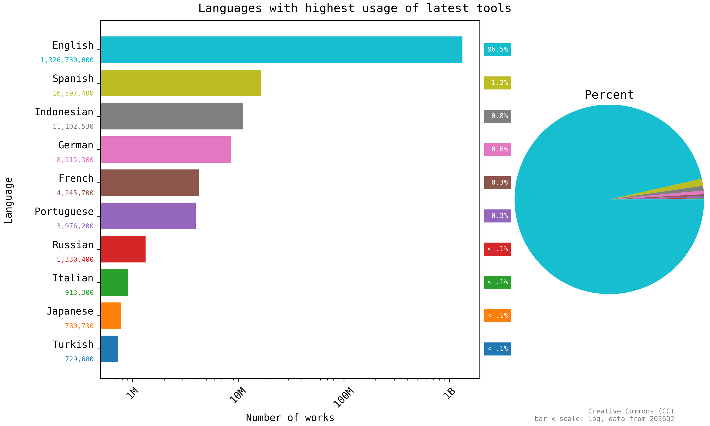

The plot shows the languages with the highest useage of the latest Creative Commons (CC) legal tools.

The latest tools include Licenses version 4.0 (CC BY 4.0, CC BY-NC 4.0, CC BY-NC-ND 4.0, CC BY-NC-SA 4.0, CC-BY-ND 4.0, CC BY-SA 4.0), CC0 1.0, and the Public Domain Mark (PDM 1.0).

The complete data set indicates there are a total of 1,380,525,825 online works using one of the latest CC legal tools.

<!-- gcs_report.py entry end Languages with highest usage of latest tools -->

<!-- gcs_report.py entry start Approved for Free Cultural Works -->

### Approved for Free Cultural Works

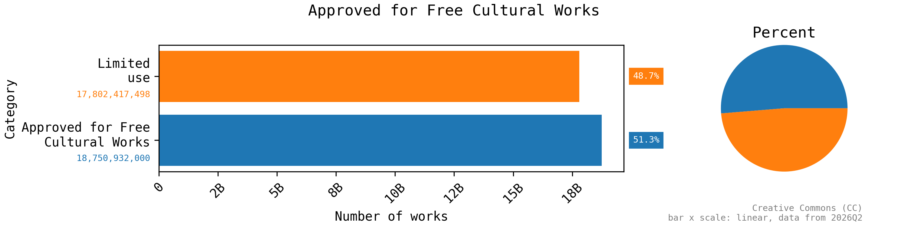

The plot shows Approved for Free Cultural Works legal tool usage.

[Understanding Free Cultural Works - Creative Commons](https://creativecommons.org/public-domain/freeworks/):

> Using [the Freedom Defined definition of a "Free Cultural Work"], material licensed under CC BY or BY-SA is a free cultural work. (So is anything in the worldwide public domain marked with CC0 or the Public Domain Mark.) CC’s other licenses– BY-NC, BY-ND, BY-NC-SA, and BY-NC-ND–only allow more limited uses, and material under these licenses is not considered a free cultural work.

<!-- gcs_report.py entry end Approved for Free Cultural Works -->

<!-- SECTION end gcs_report.py -->
<!-- SECTION start github_report.py -->

## GitHub

<!-- github_report.py entry start Overview -->

### Overview

The GitHub data, below, uses the `total_count` returned by the API for search queries of the various legal tools.

**The results indicate that 504,514 (0.16%)** of the 308,055,974 total public repositories on GitHub use a CC legal tool. Additionally, many more use a non-CC use a Public domain equivalent legal tools. The fetched GitHub data creates a a subtotal that showcases the different level of permission that works are released under.

The public-domain-equivalent licenses include 0BSD, CC0, MIT-0 and Unlicense. These licenses allow anyone to freely use, modify, and distribute the code without restriction. See more at [Public-domain-equivalent license](https://en.wikipedia.org/wiki/Public-domain-equivalent_license).

The CC BY 4.0 license is a permissive license that allows users to reuse the code with some conditions and attribution. See more at [Permissive license](https://en.wikipedia.org/wiki/Permissive_software_license).

The CC BY-SA 4.0 license is a copyleft license which requires any derivative works to be licensed under the same terms. See more at [Copyleft](https://en.wikipedia.org/wiki/Copyleft).

Thank you GitHub for providing public API access to repository metadata!

<!-- github_report.py entry end Overview -->

<!-- github_report.py entry start Subtotal distribution by license -->

### Subtotal distribution by license

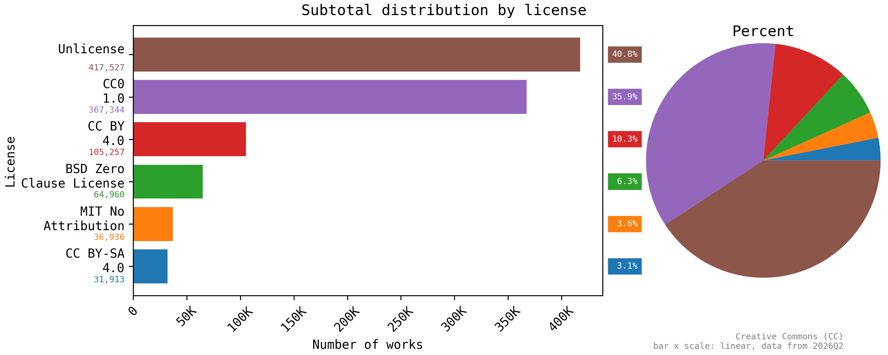

The plot shows the distribution of the different open content or public-domain-equivalent licenses (0BSD, CC BY 4.0, CC BY-SA 4.0, CC0 1.0, MIT-0, and Unlicense) used in the subtotal of GitHub repositories.

<!-- github_report.py entry end Subtotal distribution by license -->

<!-- github_report.py entry start Subtotal distribution by restriction -->

### Subtotal distribution by restriction

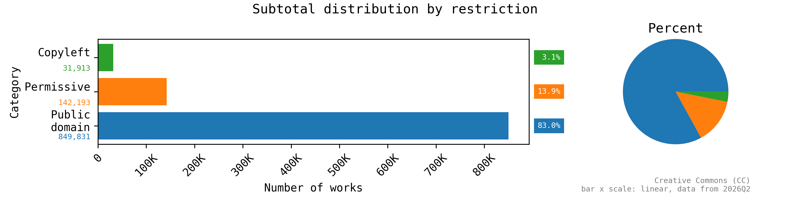

The plot shows the distribution of the different restrictions (Copyleft, Permissive, Public domain) used in the subtotal of GitHub repositories.

<!-- github_report.py entry end Subtotal distribution by restriction -->

<!-- SECTION end github_report.py -->
<!-- SECTION start smithsonian_report.py -->

## Smithsonian

<!-- smithsonian_report.py entry start Overview -->

### Overview

The Smithsonian Institute data returns the overall statistics of CC0 legal tool records. CC0 serves as the main legal tool used by the Smithsonian Institute.

The results indicate a total record of 37,160,019 objects, with a breakdown of 17,667,710 objects without CC0 Media and 5,224,061 objects with CC0 Media, taking a percentage of 11.83% in each institute member. There are 39 unique units in the data representing museums, libraries, zoos and other institutions with a minimum of 410 objects.

<!-- smithsonian_report.py entry end Overview -->

<!-- smithsonian_report.py entry start Totals by 10 Units -->

### Totals by 10 Units

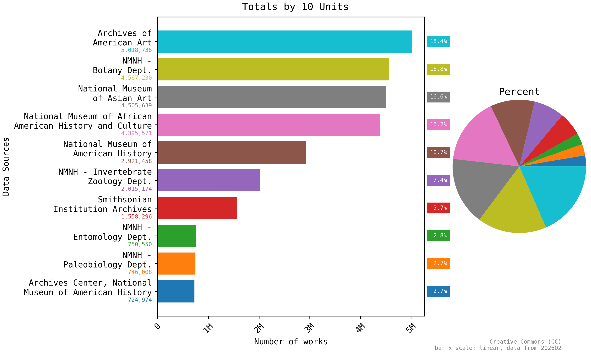

The plot shows totals by units. It shows the distribution of top 10 institute member across the Smithsonian Institute with an average of 2,720,363.6 objects across the top 10 Institute members.

<!-- smithsonian_report.py entry end Totals by 10 Units -->

<!-- smithsonian_report.py entry start Totals by lowest 10 Units -->

### Totals by lowest 10 Units

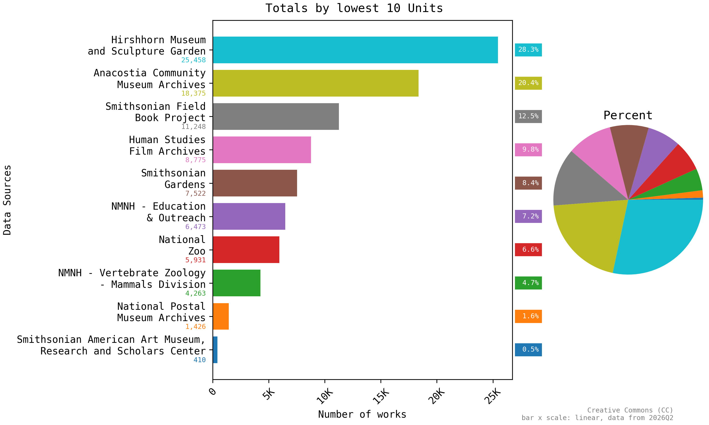

The plot shows totals by units. It shows the distribution of lowest 10 institute member across Smithsonian Institute with an average of 8988.1 objects across the lowest 10 institute members.

<!-- smithsonian_report.py entry end Totals by lowest 10 Units -->

<!-- smithsonian_report.py entry start Breakdown of CC0 records by top 10 units -->

### Breakdown of CC0 records by top 10 units

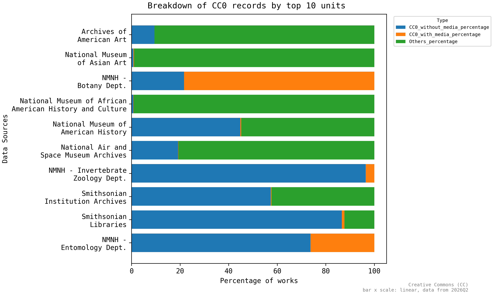

The plot shows totals by CC0 records. It shows the top 10 units with a breakdown of CC0 records without media, CC0 records with media and records that are not associated with CC0.

<!-- smithsonian_report.py entry end Breakdown of CC0 records by top 10 units -->

<!-- smithsonian_report.py entry start Breakdown of CC0 records by lowest 10 units -->

### Breakdown of CC0 records by lowest 10 units

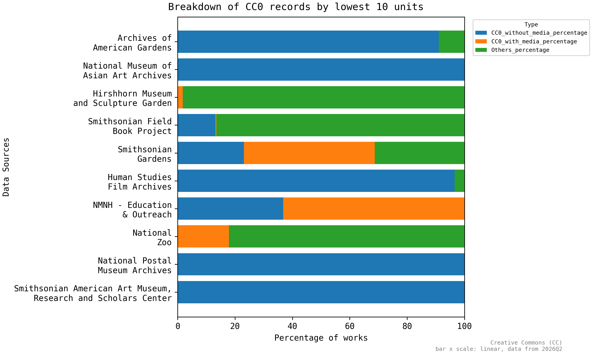

The plot shows totals by CC0 records. It shows the lowest 10 units with a breakdown of CC0 records without media, CC0 records with  media and records that are not associated with CC0.

<!-- smithsonian_report.py entry end Breakdown of CC0 records by lowest 10 units -->

<!-- SECTION end smithsonian_report.py -->
<!-- SECTION start wikipedia_report.py -->

## Wikipedia

<!-- wikipedia_report.py entry start Overview -->

### Overview

This report provides insights into the usage of the Creative Commons Attribution 4.0 International across the different language editions of Wikipedia. The Wikipedia data, below, uses the `Count` field from the Wikipedia API to quantify the number of articles in each language edition of Wikipedia.

**The total number of Wikipedia articles across 353 languages is 67,017,410. The top 10 languages account for 31,835,598 articles, which is 47.50% of the total articles. The average number of articles per language is 189,851.02.**

Thank you to the volunteers who curate this data and the Wikimedia Foundation for making it publicly available!

<!-- wikipedia_report.py entry end Overview -->

<!-- wikipedia_report.py entry start Language Representation -->

### Language Representation

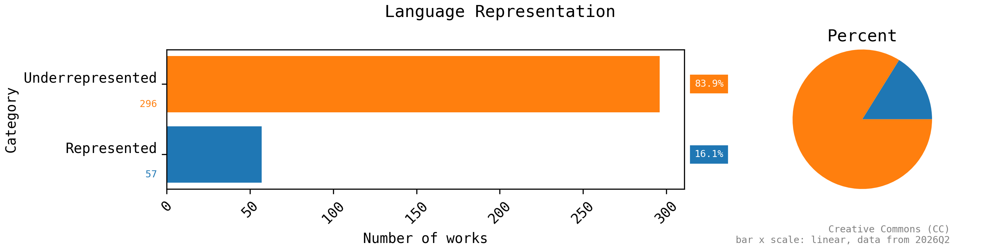

The plot shows the language representation across the different language editions of Wikipedia. It shows how many languages are underrepresented (below average number of articles) versus represented (above average number of articles).

<!-- wikipedia_report.py entry end Language Representation -->

<!-- wikipedia_report.py entry start Most represented languages -->

### Most represented languages

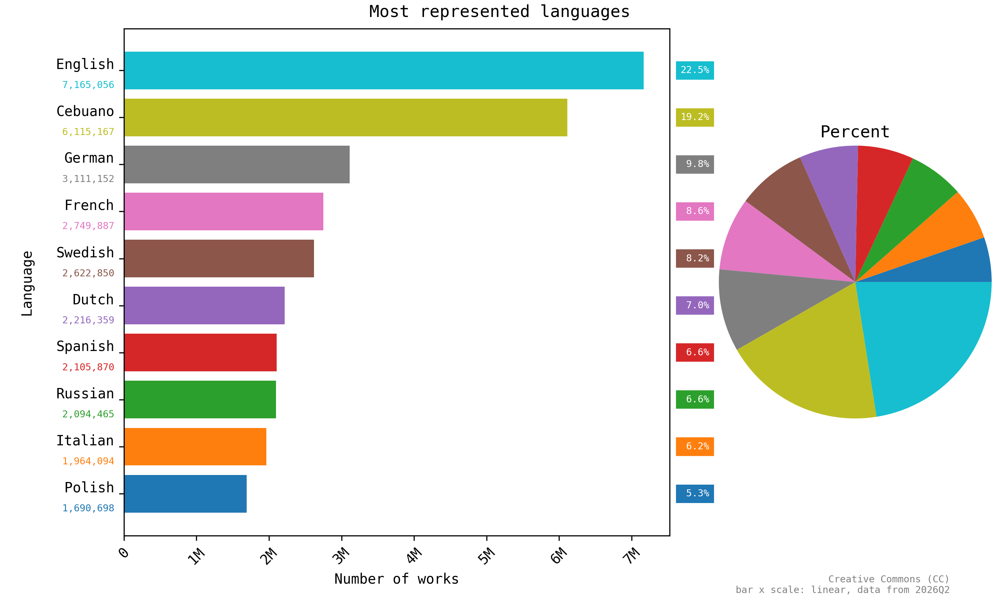

The plot shows the most represented languages across the different language editions of Wikipedia.

<!-- wikipedia_report.py entry end Most represented languages -->

<!-- wikipedia_report.py entry start Least represented languages -->

### Least represented languages

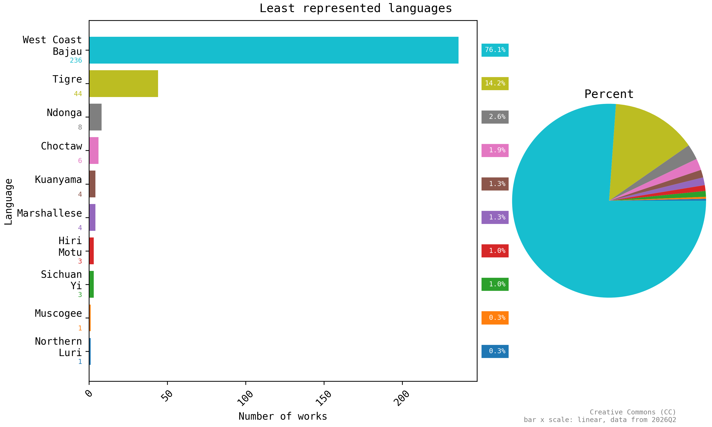

The plot shows the least represented languages across the different language editions of Wikipedia.

<!-- wikipedia_report.py entry end Least represented languages -->

<!-- SECTION end wikipedia_report.py -->
<!-- SECTION start zzz-notes.py -->

## Notes

<!-- zzz-notes.py entry start Data locations -->

### Data locations

This report was generated as part of:

**[creativecommons/quantifying][repo]:** *quantify the size and diversity of the commons--the collection of works that are openly licensed or in the public domain*

The data used to generate this report is available in that repository at the following locations:

 | Resource        | Location |
 | --------------- | -------- |
 | Fetched data:   | [`1-fetch/`](1-fetch) |
 | Processed data: | [`2-process/`](2-process) |
 | Report data:    | [`3-report/`](3-report) |

[repo]: https://github.com/creativecommons/quantifying

<!-- zzz-notes.py entry end Data locations -->

<!-- zzz-notes.py entry start Usage -->

### Usage

The Creative Commons (CC) icons and logos are for use under the Creative Commons Trademark Policy (see [Policies - Creative Commons][ccpolicies]). **They *aren't* licensed under a Creative Commons license** (also see [Could I use a CC license to share my logo or trademark? - Frequently Asked Questions - Creative Commons][tmfaq]).

[![CC0 1.0 Universal (CC0 1.0) Public Domain Dedicationbutton][cc-zero-png]][cc-zero]
Otherwise, this report (including the plot images) is dedicated to the public domain under the [CC0 1.0 Universal (CC0 1.0) Public Domain Dedication][cc-zero].

[ccpolicies]: https://creativecommons.org/policies
[tmfaq]: https://creativecommons.org/faq/#could-i-use-a-cc-license-to-share-my-logo-or-trademark
[cc-zero-png]: https://licensebuttons.net/l/zero/1.0/88x31.png "CC0 1.0 Universal (CC0 1.0) Public Domain Dedication button"
[cc-zero]: https://creativecommons.org/publicdomain/zero/1.0/ "Creative Commons — CC0 1.0 Universal"

<!-- zzz-notes.py entry end Usage -->

<!-- SECTION end zzz-notes.py -->
